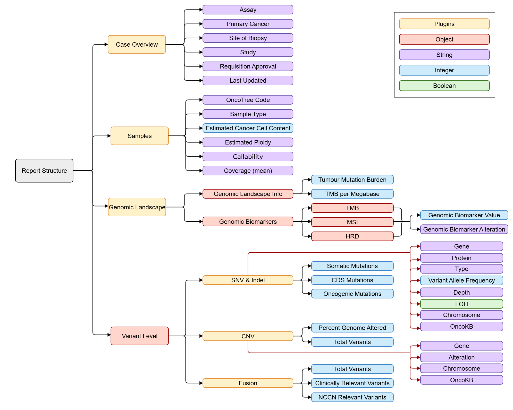

# README

## Top-level Schemas
* [Query Report Structure Schema](./schema_query.json)
* [Clinical Report Structure Schema (Biological Variables)](./schemas/clinical_schema.json)
* [Research Report Structure Schema (Biological Variables)](./schemas/research_schema.json)

## Top-level Fields
* Case Overview: assay, primary cancer, site of biopsy, study
* Sample Information: sample type, OncoTree code, estimated cancer cell content, estimated ploidy, callability
* Genomic Landscape: percent genome altered, cancer-specific percentile, genomic biomarkers (TMB, HRD, MSI)
* SNVs and Indels: mutations (somatic, coding, oncogenic), variant information (gene, chromosome, protein, SNV type, OncoKB)
* CNVs: percent genome altered, variant information (gene, chromosome, CNV type, OncoKB)
* Fusion: variant information

## Variable Fields
Case Overview
* assay: string, genomic sequencing assay
* primary_cancer: string, cancer type
* site_of_biopsy: string, biopsy type/location
* study: string, research study name

Sample Information
* OncoTree code: string, code associated with cancer
*  Sample type: string, collection type
*  Estimated Cancer Cell Content (%): integer, percent of cancer cell content
*  Estimated Ploidy: string, estimated ploidy
*  Callability (%): string, accuracy of call
*  Coverage (mean): string, average coverage

Genomic Landscape
*  Tumour Mutation Burden: integer, total TMB
*  TMB per megabase: integer, relative TMB value
*  genomic_biomarkers: object, TMB/HRD/MSI genomic biomarker values
*   Cancer-specific Percentile: string, percentile within specific cohort
*   purity: integer, fraction of cancer cells in tumour
*   Genomic biomarker value: integer, TMB/MSI/HRD per megabase
*   Genomic biomarker alteration: string, biomarker title

SNV_Indel
*   somatic mutations: integer, number of somatic variants
*   coding sequence mutation: integer, number of coding variants
*  oncogenic mutations: integer, number of oncogenic mutations

CNV
*   percent genome altered: integer, percent altered due to variant
*   total variants: integer, total variants found

Fusion
*   Total variants: integer, total variants found
*   Clinically relevant variants: integer, number of clinically relevant (OncoKB)
*   nccn_relevant_variants: integer, number of NCCN-relevant variants

SNV/Indel, CNV, Fusion
*  Gene: string, gene names
*  protein: string, protein alterations
*  type: string, variant classification
*  vaf: integer, variant allele frequency
*  depth: string, variant read depth
*  LOH: boolean, loss of heterozygosity exhibited
*  Chromosome: string, position

## Version Note
The schemas linked above follow the JSON Schema Spec version: `http://json-schema.org/draft-07/schema#`