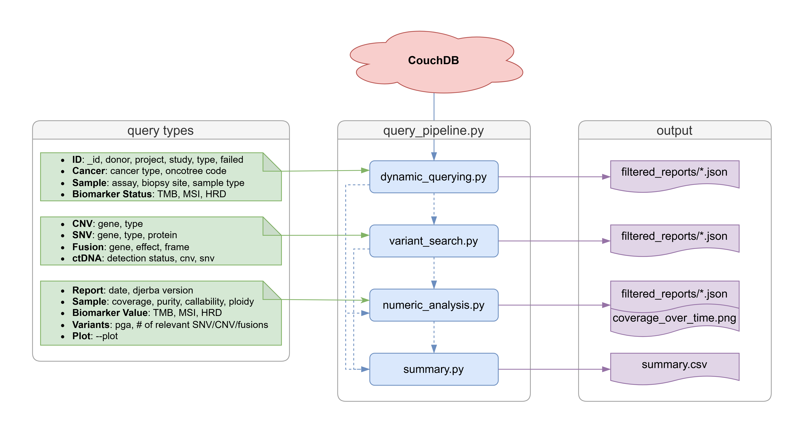

# Guide to Querying CouchDB
#### Table of Contents
1. [Scripts: Supported Querying](#scripts-supported-querying)
2. [Running the Pipeline](#usage-guide-running-the-pipeline)
3. [Running Individual Scripts: Dynamic Querying](#usage-guide-dynamic-querying-individual)
4. [Running Individual Scripts: Variant Search](#usage-guide-variant-search-individual)
5. [Running Individual Scripts: Numeric Search](#usage-guide-numeric-search-individual)
6. [Running Individual Scripts: Summary Table](#usage-guide-summary-table-individual)
7. [Query Types](#query-types)

<br>

# Scripts: Supported Querying
Querying is done using the pipeline script, found under **[couchDB_query_pipeline.py](./couchDB_query_pipeline.py)**.

|                      Script                                |            Supports                                  |
|------------------------------------------------------------|------------------------------------------------------|
|**[couchDB_dynamic_query.py](./couchDB_dynamic_query.py)**  |Local report retrieval via string-based Mango querying|
|**[couchDB_variant_search.py](./couchDB_variant_search.py)**|Variant-based filtering (i.e., SNV, CNV, Fusions)     |
|**[couchDB_dynamic_query.py](./couchDB_dynamic_query.py)**  |Numeric-based filtering & plotting report accumulation|
|**[couchDB_summary.py](./couchDB_summary.py)**       |Generation of a thorough summary table                |



<br>

# Usage Guide: Running the Pipeline
Querying requires a config YAML, found under **[couchDB_query_pipeline.yaml](./couchDB_query_pipeline.yaml)**. To run the pipeline in commandline, python (v8+):

```
python3 couchDB_query_pipeline.py --config couchDB_query_pipeline.yaml
```

Config must be set by running `--config couchDB_query_pipeline.yaml`, which specifies the filters and login credentials.
- Filters should be defined within the [pre-existing YAML file](./couchDB_query_pipeline.yaml), in which fields that are not being searched should be set to null or false, as per the template.
- **Examples** on how to format the config YAML for the pipeline script can be found under [example_config.md](./docs/example_config.md)
- Connection **must** be authenticated by setting host, port, database name, and login credentials. Login is directly added to pre-existing config YAML.

## Run Retrieve
Retrieval [script](./couchDB_dynamic_query.py) allows for local download of reports from CouchDB. Dynamic querying to download reports based on Mango search logic works best for string-based querying. This script supports querying through fields containing string values. Run_retrieve **must** be set to true for downstream querying.

```
run_retrieve: true
```

## Run Variant
Variant searching [script](./couchDB_variant_search.py) allows for gene or alteration-based searching. To bypass naming conventions, python-based search logic is applied to already downloaded reports to perform variant-based querying.

To filter through variant-based parameters:
```
run_variant: true
```

If no variant filters are applied, must set to false:
```
run_variant: false
```

### Run Numeric
Numeric querying [script](./couchDB_numeric_analysis.py) allows for analysis and plotting of quantitative data. To bypass lexicographic logic applied to integers saved as strings, python-based search logic is applied to downloaded reports to perform integer querying and visual analysis. 

To filter through numeric parameters:
```
run_numeric: true
```

If no numeric filters are applied, must set to false:
```
run_numeric: false
```

### Run Summary
Summary [script](./couchDB_summary.py) results in the generation of a summary table as a CSV file. This table contains all data extracted from reports, providing and overview for data analysis or visualization.

To generate a summary table:
```
run_summary: true
```

<br>

---

<br>

# Usage Guide: Dynamic Querying (Individual)
Dynamic querying can be run without running the pipeline. This is done through directly accessing CouchDB, which requires login credentials. Such credentials can be saved in a text file, organized as follows:
```
host: url
port: 0000
db_name: database_name
username: username
password: password
```

Similarly, filters must  be defined in a separate YAML file. Use this simplified [filters template](./couchDB_dynamic_filters.yaml) to set filters. Supported filters can be found under the query type's [dynamic filters section](#dynamic-querying).

To simply download reports:
```
python3 couchDB_dynamic_query.py --login_file login.txt --filters_file couchDB_dynamic_filters.yaml --output_dir downloaded_reports/
```

To count filtered reports without downloading files:
```
python3 couchDB_dynamic_query.py --login_file login.txt --filters_file couchDB_dynamic_filters.yaml --count
```

<br>

# Usage Guide: Variant Search (Individual)
Variant search can be done without running the entire pipeline, if a folder containing JSON reports exists. Use in-line flags to specify filters. Supported filter flags can be found under the query types's [variant search section](#variant-based-querying).

Sample variant filtering for reports containing TP53 SNVs:
```
python3 couchDB_variant_search.py --input_dir folder_containing_JSONs/ --snv_gene "TP53" --output_dir filtered_TP53_snvs/
```

<br>

# Usage Guide: Numeric Search (Individual)
Numeric analysis (and plotting) can be done without running the entire pipeline, if a folder containing JSON reports exists. Use in-line flags to specify filters. Supported filter flags can be found under the query types's [numeric analysis section](#numeric-based-querying).

Sample numeric filtering for reports with failed purity scores:
```
python3 couchDB_numeric_analysis.py --input_dir folder_containing_JSONs/ --purity "<=0.3" --output_dir filtered_failed_purity/
```

To download a [plot](../3_dataVisualization/accrual_by_coverage/coverage_over_time_greeq115.png), which can be applied with or without any other numeric filters:
```
python3 couchDB_numeric_analysis.py --input_dir folder_containing_JSONs/ --purity "<=0.3" --output_dir filtered_failed_purity/ --plot
```

<br>

# Usage Guide: Summary Table (Individual)
Summary tables can be generated without running the entire pipeline, if a folders containing JSON reports exists. To download a summary table:
```
python3 couchDB_summary.py --input_dir folder_containing_JSONs/ --output_name summary_table
```

<br>

---

<br>

# Query Types
Querying couchDB supports string-based search via Mango and numeric-based search via Python. Filters may be set through YAML files and/or search flags, depending on the search focus.


## Dynamic Querying
Fields that do not require querying should remain `null`. Individual JSON file(s) will be output for reports satisfying specific query requirements.

| Filter | Definition | Example |
|--------|------------|---------|
| `report_id` | Report ID | `"REPORT_123-v1"` or `"REPORT_123"` |
| `donor` | Donor ID | `"DONOR_123"` |
| `project` | Project name | `"PROJECT"` |
| `study` | Study name | `"STUDY"` |
| `report_type` | Report | `"clinical"` |
| `cancer_type` | Primary cancer diagnosis | `"pancreatic adenocarcinoma"` |
| `oncotree_code` | Oncotree code | `"PAAD"` |
| `assay` | Assay | `"WGTS"` |
| `biopsy_site` | Biopsy/surgery | `"left crest"` |
| `sample_type` | Type of sample | `"FFPE  tissue block"` |
| `hrd_status` | HRD status | `"HRP"` |
| `msi_status` | MSI status | `"MSS"` |
| `tmb_status` | TMB status | `"TMB-L"` |
| `failed` | Report failure status | `false` |


## Variant-Based Querying
Query filters can be input using the flag specified below. Individual JSON file(s) will be output for reports satisfying specific query requirements. For specific gene searches, input a singular string containing the gene code. Filters are stacked, thus applying a specific gene and type filter searches for that gene + effect (i.e., TP53 amplification, KRAS missense). Switching between AND or OR is supported when querying through SNV and CNV genes. Fusion gene querying exclusively supports AND condition.

| Filter | Definition | Example |
|--------|------------|---------|
| `--cnv_gene` | CNV-containing gene | `"TP53"` |
| `--cnv_type` | CNV type associated with search | `"amplification"` |
| `--snv_gene` | SNV-containing gene | `"KRAS"` |
| `--snv_type` | SNV type asssociated with search | `"Missense Mutation"` or `"missense"` |
| `--snv_protein` | Protein change resulting from SNV | `"p.S110R"` |
| `--fusion_gene` | Fusion-containing gene(s) | `"SDC1"` |
| `--fusion_effect` | Fusion effect | `"Likely Loss-of-function"` or `"loss"` |
| `--fusion_frame` | Fusion associated frame | `"out of frame"` or `"out"` |
| `--ctdna_status` | ctDNA status, all fields | `"Detected"` |
| `--ctdna_cnv` | ctDNA status in CNV | `"True"` |
| `--ctdna_snv` | ctDNA status in SNV | `"False"` |

| Operator | Definition |
|----------|------------|
| `[GENE1, GENE2]` | GENE1 OR GENE2 |
| `{AND: [GENE1, GENE2]}` | GENE1 AND GENE2 |


## Numeric-Based Querying
Query filters can be input using the flag specified below. Individual JSON file(s) will be output for reports satisfying specific query requirements. Operator must be included with the input value, otherwise will be defaulted to `>=`. For filtering across a range (inclusive), input a list formatted as `"[min,max]"` (i.e., `"[0,4]"`). For searching across various values (OR condition), input values seperated by commas as `"num1, num2, num3"` (i.e., `"0, 4, 7"`).
| Filter | Definition | Example |
|--------|------------|---------|
| `--date_reported` | Date report created | `"2026/12/01"` |
| `--djerba_version` | Report version | `"1.10.0"` |
| `--coverage` | Average read coverage | `"==75.0"` or `70,80` |
| `--purity` | Estimated tumour purity % | `"==75"` or `70,80` |
| `--callability` | Percent of callable genome | `"==75.0"` or `70,80` |
| `--ploidy` | Estimated chromosomal copy number | `"==2.75"` or `2,3` |
| `--TMB` | TMB value | `"==79"` |
| `--tmb_value` | TMB score per Mb | `"==0.7"` |
| `--hrd_value` | HRD score per Mb | `"==2.1"` |
| `--msi_value` | MSI score per Mb | `"==0.9"` |
| `--pga` | Percent genome altered | `"==2.75"` or `2,3` |
| `--cnv_clinical` | Clinically relevant CNVs | `"==2.75"` or `2,3` |
| `--snv_oncological` | Oncologically relevant SNVs | `"==2.75"` or `2,3` |
| `--fusion_clinical` | Clinically relevant fusions | `"==2.75"` or `2,3` |
| `--plot` | Plotting cumulative report count | `true` |

| Operator | Definition |
|----------|------------|
| `>` | Greater than input value |
| `<` | Less than input value |
| `>=` | Greater than or equal to input value |
| `<=` | Less than or equal to input value |
| `==` | Equal to input value |
| `"[min,max]"` | Search across range, inclusive |