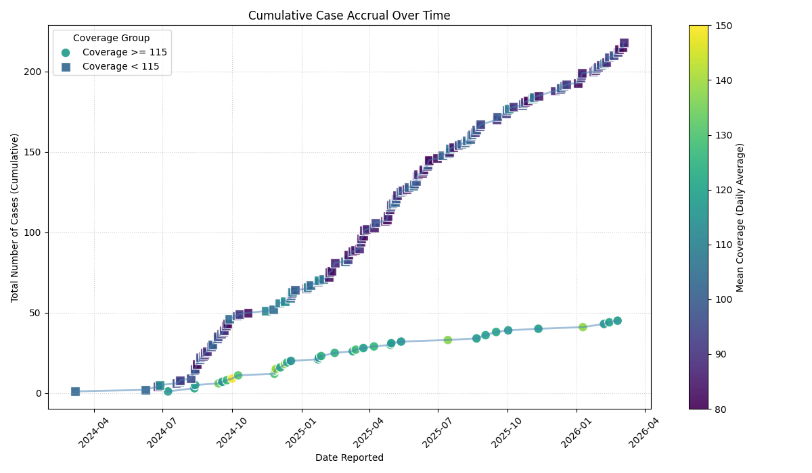
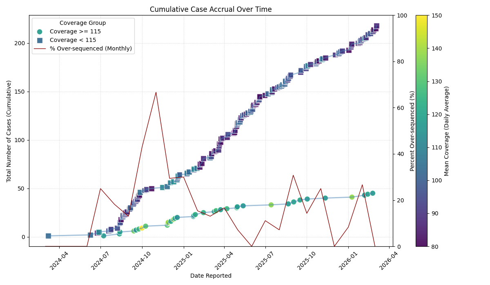
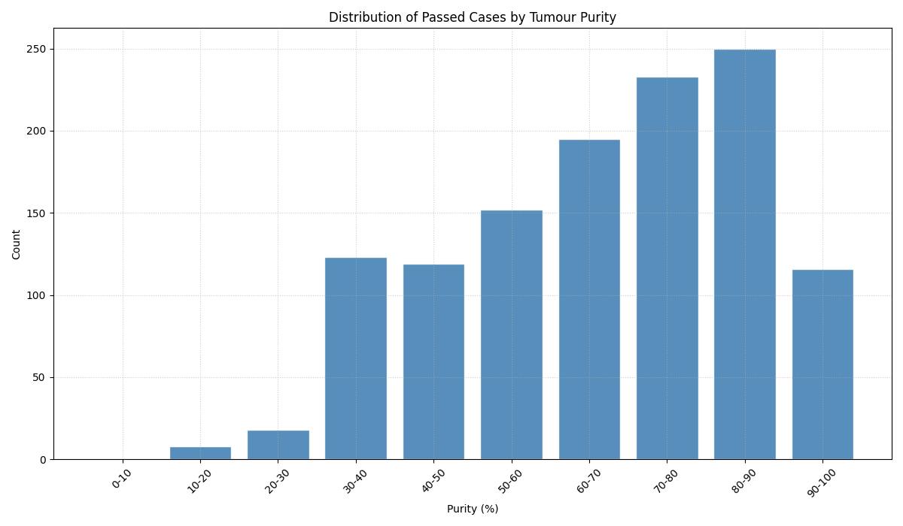
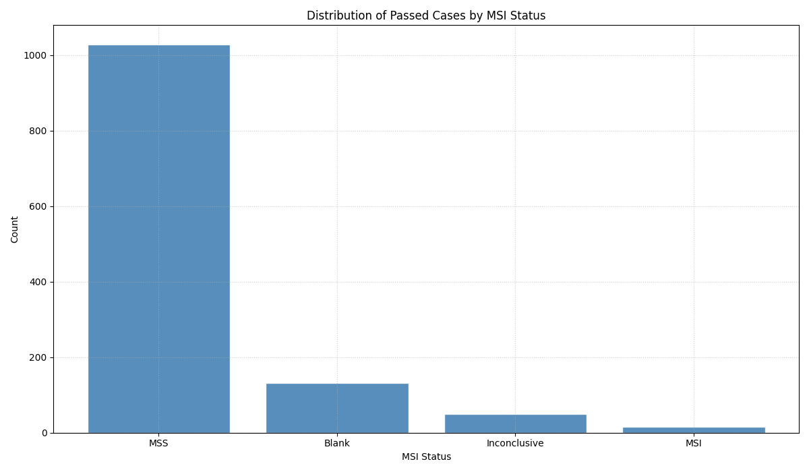
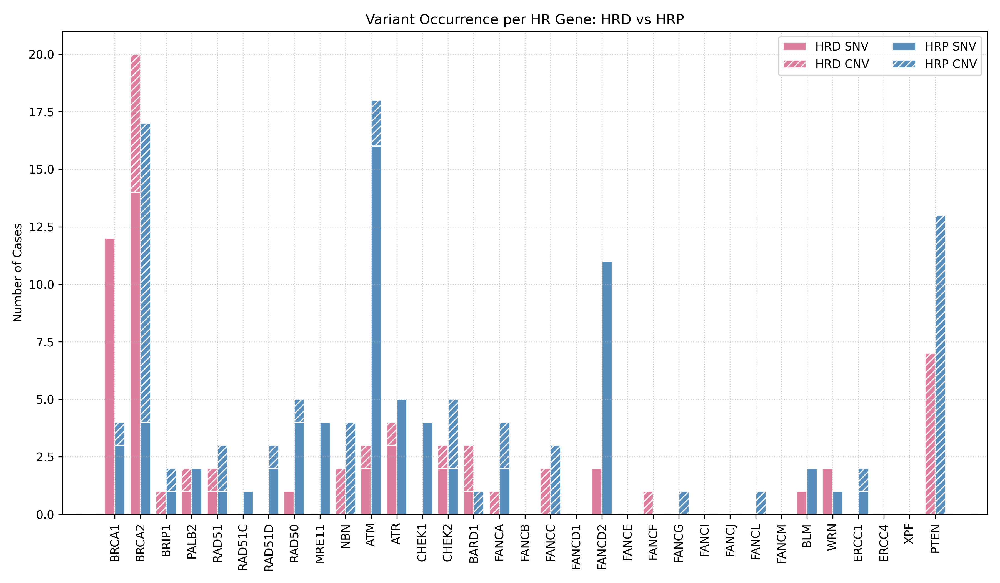

# Data Aggregation & Cohort Level Summaries
- Extract and normalize key variables across reports:
    - Cancer type
    - Key mutations (e.g., KRAS)
    - Biomarkers (HRD, MSI-H, TMB, their scores)
    - Residual disease 
- Build aggregation logic to produce:
    - Counts and proportions
    - Summaries by cancer type or project or report category

Deliverables
- Cleaned tabular dataset derived from CouchDB
- Aggregation scripts
- Summary figures/tables suitable for presentation

 

## Accrual by Coverage
Plotting number of cases accumulated by quarter, with mean coverage (per case) being mapped.

Allows for plotting the percentage for better visual of ratios. Intervals can be set to daily or monthly, with date ranges also being specified for total view of close-up snapshot.

 

## Distribution by Parameters
Plotting number of cases by parameter as histograms.

Distribution plots can allow for view of non-numerical bins.

 

## Distribution by Combined Parameters
Plotting the number of occurrences of variants (SNV, CNV) in the HR gene by HR status (HRD, HRP).

